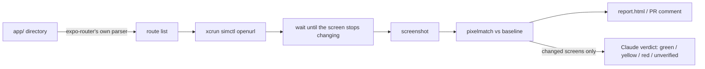

# routeshot

Screenshot every expo-router route, before and after an EAS update, and show what changed.

Expo's OTA playbook says to install the update and eyeball it. This does the eyeballing: it
finds every screen from your `app/` directory, opens each one on the iOS Simulator, takes a
picture, diffs it against the last run, and asks a model whether anything looks broken.

<!-- hero: real before/after run on example/, added after the first captured run -->

## Quickstart (macOS, Xcode, an iOS simulator)

```sh
pnpm add -D routeshot            # or: npx routeshot
npx expo run:ios                 # your dev build, running on the simulator
npx routeshot capture --label before
# change something
npx routeshot capture --label after
npx routeshot compare before after --open
```

`compare` exits 1 when a screen changed more than the threshold, so it drops straight into CI.

## How it works



- Routes come from `expo-router`'s `getRoutesCore`, vendored, so the list cannot drift from what the router would actually serve.
- The simulator layer is a port of `@expo/cli`'s `simctl.ts` and Expo Orbit's `simulator.ts`.
- A screen counts as settled when two consecutive frames 300 ms apart are identical, with a 5 s cap and a per-route override.
- Identical pixels never call the model. Changed screens are sent as before, after, and diff mask; the model returns a score, a defect class, and a one-line caption. Two hard-coded thresholds map the score to green, yellow, or red. When it cannot judge, the result is `unverified`, never a silent green.

## EAS update mode

`routeshot capture --update-url https://u.expo.dev/<projectId>/group/<groupId>` loads a specific
published update before capturing, so you can diff update N against update N-1 with no rebuild.

This needs a dedicated **runner build** that is never shipped to users: a development build whose
`app.config` sets `updates.disableAntiBrickingMeasures: true` only when `EAS_BUILD_PROFILE` is
`routeshot`, and whose root layout calls `useRouteshotUpdateOverride()` from `routeshot/expo`. The
override is Expo's own `Updates.setUpdateURLAndRequestHeadersOverride`. See `example/` for the
exact `eas.json` and `app.config.ts`.

## GitHub Action

```yaml
- uses: ColeBlender/routeshot@v1
  with:
    project-root: example
    server-url: ${{ secrets.ROUTESHOT_SERVER_URL }}
    server-token: ${{ secrets.ROUTESHOT_SERVER_TOKEN }}
```

Runs on a macOS runner, uploads the run to the report server, and leaves one comment on the PR
that lists the screens that changed with the model's caption and a link to the side-by-sides.

## Report server

`packages/server` is a small Hono service (Postgres for runs and PNGs) that hosts reports, resolves
baselines by branch, and runs the judge with your `ANTHROPIC_API_KEY`. Deploy it to Railway with
`railway.json`. One shared bearer token per repo in v1.

## Limitations

<!-- numbers below are filled from the measured spike runs -->
- iOS only. The `Simulator` interface is the seam for an `adb` adapter.
- Dynamic routes (`[id]`) need params in `routeshot.config.ts`; without them the route is skipped loudly and the exact snippet to paste is printed.
- Screens behind authentication capture whatever the app shows when opened cold.
- Settle detection is a heuristic. Screens with permanent animation hit the 5 s cap and are reported as not settled.
- The judge's score is not calibrated probability. Thresholds were tuned on the example app's labeled screens only (`pnpm judge:eval`).
- One device size, one appearance per run.

## Prior art

Sherlo does OTA-aware visual testing as a hosted product driven by Storybook stories. react-native-owl
and Maestro screenshot what you script. routeshot walks the routes expo-router already knows about,
so there is nothing to register.

## Built on Expo's code

`packages/routeshot/src/vendor/` carries `getRoutesCore.ts`, `matchers.tsx`, and the fs-backed
`RequireContext` ponyfill from `expo/expo`, with the commit SHA in each header. `simulator.ts` is a
port of `@expo/cli` and Expo Orbit. If this were upstream work, the two things worth publishing are
a public `getRoutes` entry that takes a filesystem context, and the simctl helpers as a package.

## How this was built

Written with Claude Code over a few sessions. Claude drafted most of the code and tests against a
spec I wrote; I reviewed every diff before it landed. One decision I made against its output:
<!-- fill in the real one -->. The repo's own `AGENTS.md` is the map it worked from.

## License

MIT
