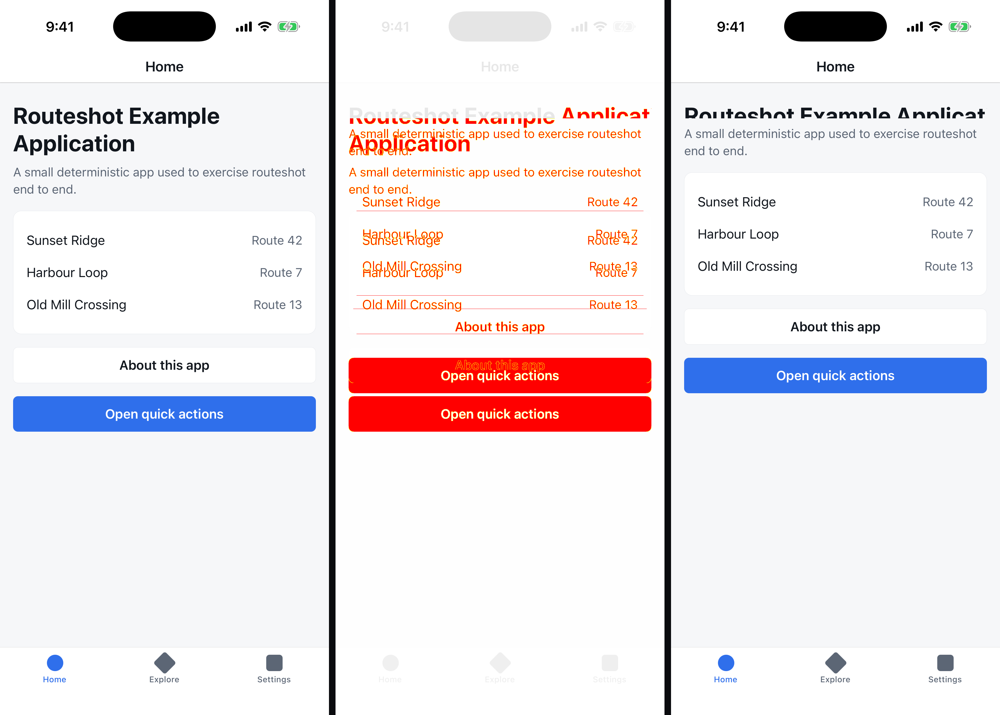
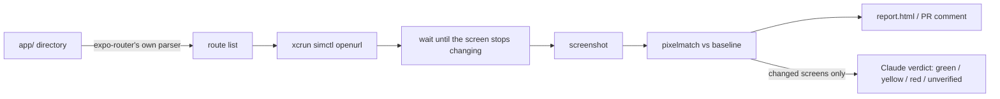

# routeshot

Screenshot every expo-router route, before and after an EAS update, and show what changed.

Expo's OTA playbook says to install the update and eyeball it. This does the eyeballing: it
finds every screen from your `app/` directory, opens each one on the iOS Simulator, takes a
picture, diffs it against the last run, and asks a model whether anything looks broken.



That is a real run on the app in `example/`: baseline on the left, changed pixels in the middle,
the broken build on the right. `compare` reported it as 10.65% changed; the model called it
`clipped`.

## Quickstart

You need macOS with Xcode and an iOS simulator runtime, CocoaPods, Node 22+, and pnpm 10
(`corepack enable` or `npm i -g pnpm`).

```sh
git clone https://github.com/ColeBlender/routeshot && cd routeshot
pnpm install
cd example && npx expo run:ios        # builds the example app (a few minutes) and starts Metro
```

Leave that terminal on Metro and open a second one in `example/`:

```sh
pnpm exec routeshot capture --label before
# stop Metro and restart it with a broken screen: EXPO_PUBLIC_ROUTESHOT_SCENARIO=broken npx expo start
pnpm exec routeshot capture --label after
pnpm exec routeshot compare before after --open
```

Each capture takes about 20 seconds for the example's 7 routes. `compare` writes
`.routeshot/compare/<before>__<after>/report.html`, prints the changed routes with their pixel
ratios, and exits 1 because five screens changed.

Point it at your own app instead: run the same `capture` from your project directory. Scheme and
bundle id come from `app.json`; a development build is detected from `expo-dev-client` in your
dependencies and booted from Metro; dynamic routes need params in `routeshot.config.ts`.
`compare` exits 1 when a screen changed more than the threshold, so it drops straight into CI.
The package is not on npm yet; the `@v1` tag and `npx routeshot` arrive with the public release.

## How it works



- Routes come from `expo-router`'s `getRoutesCore`, vendored, so the list cannot drift from what the router would actually serve.
- The simulator layer is a port of `@expo/cli`'s `simctl.ts` and Expo Orbit's `simulator.ts`.
- A screen counts as settled when two consecutive frames 300 ms apart are identical, with a 5 s cap and a per-route override.
- Identical pixels never call the model. Changed screens are sent as before, after, and diff mask; the model returns a score, a defect class, and a one-line caption. Two thresholds (`JUDGE_YELLOW` 40, `JUDGE_RED` 75 by default) map the score to green, yellow, or red. When it cannot judge, the result is `unverified`, never a silent green.

## What the numbers look like

Measured on the example app, iPhone 17 Pro simulator, iOS 26.5, development build loading from Metro:

| Comparison                                                                       | Result                                                        |
| -------------------------------------------------------------------------------- | ------------------------------------------------------------- |
| Two identical captures, 7 routes                                                 | 0 differing pixels on every route                             |
| Benign edits (copy tweak, color change, reordered list)                          | 0.30% to 0.47% of pixels on the 3 touched routes, 0 elsewhere |
| Deliberate defects (clipped title, off-screen button, overlap, blank, error box) | 1.17% to 10.65% on the 5 broken routes, 0 elsewhere           |
| A full 7-route capture                                                           | about 19 seconds; screens settle in 0.9 to 3.3 seconds        |

The default threshold is 0.1%, well under the smallest real change and far above the measured noise.

The judge, scored with `pnpm judge:eval` against the same runs (`claude-sonnet-5`, thresholds 40 / 75):

| Screen              | Change                           | Score   | Verdict                                 |
| ------------------- | -------------------------------- | ------- | --------------------------------------- |
| Home                | title clipped mid-word           | 92      | red, `clipped`                          |
| About               | error box instead of content     | 97      | red, `error`                            |
| Explore             | button drawn over the caption    | 92      | red, `overlap`                          |
| Item detail         | blank below the header           | 96      | red, `blank`                            |
| Billing             | primary button pushed off-screen | 90      | red, `blank` (right level, wrong label) |
| Home                | subtitle copy edited             | 3       | green                                   |
| Explore             | accent color changed             | 3       | green                                   |
| Settings            | list reordered                   | 5       | green                                   |
| 6 untouched screens | identical pixels                 | no call | green                                   |

14 of 14 verdict levels correct, 13 of 14 defect labels. Scores cluster at 3 to 5 for intentional
changes and 90 to 97 for defects, so the 40 / 75 thresholds are not doing delicate work on this set.
A larger labeled set is the first thing to build before trusting them on a real app.

## EAS update mode

`routeshot capture --update-url <manifest URL>` loads a specific published update before
capturing, so you can diff update N against update N-1 with no rebuild. Two URL forms work, and
both are what the EAS dashboard hands you:

- `https://u.expo.dev/update/<updateId>` is one platform's update. `eas update --json` prints it as
  `manifestPermalink`, and it is the most precise thing to pass from CI.
- `https://u.expo.dev/<projectId>/group/<groupId>` is the whole update group; the server picks the
  platform from the request headers.

**On a development build this needs nothing else.** `expo-dev-client`'s launcher takes a manifest
URL exactly where it takes a Metro URL, so an ordinary `npx expo run:ios` build, with rollback
protection left on, loads any published update for its runtime version. Verified end to end on
iOS: two updates published to one branch, captured through `--update-url`, and the diffs matched
the Metro-driven runs to the pixel.

The **runner build** is only for the release path, where there is no launcher: a build whose
`app.config` sets `updates.disableAntiBrickingMeasures: true` only when `EAS_BUILD_PROFILE` is
`routeshot`, and whose root layout calls `useRouteshotUpdateOverride()` from `routeshot/expo`. The
override is Expo's own `Updates.setUpdateURLAndRequestHeadersOverride`, and such a build is never
shipped to users. See `example/` for the exact `eas.json` and `app.config.ts`.

## GitHub Action

```yaml
- uses: ColeBlender/routeshot@main
  with:
    project-root: example
    server-url: ${{ secrets.ROUTESHOT_SERVER_URL }}
    server-token: ${{ secrets.ROUTESHOT_SERVER_TOKEN }}
```

Runs on a macOS runner, uploads the run to the report server, and leaves one comment on the PR
that lists the screens that changed with the model's caption and a link to the side-by-sides.
Set `fail-on-change: true` to fail the job when anything changed above the threshold. Inputs are
passed to the scripts as environment variables, never interpolated into them, since a branch name
on a fork PR is attacker-controlled.

## Report server

`packages/server` is a small Hono service (Postgres for runs and PNGs) that hosts reports, resolves
baselines by branch, and runs the judge with your `ANTHROPIC_API_KEY`. Deploy it to Railway with
`.railway/railway.ts`. One shared bearer token per repo in v1.

## Limitations

- iOS only. The `Simulator` interface is the seam for an `adb` adapter.
- Dynamic routes (`[id]`) need params in `routeshot.config.ts`; without them the route is skipped loudly and the exact snippet to paste is printed.
- Screens behind authentication capture whatever the app shows when opened cold.
- Route modules are never evaluated, so routes that exist only through `generateStaticParams` are not discovered. One params fixture per dynamic template is captured.
- Settle detection is a heuristic. Screens with permanent animation hit the 5 s cap and are reported as not settled.
- Pixel noise was measured at zero on one machine. Baselines and candidates should still come from the same runner image; a hosted macOS runner has not been measured yet.
- The judge's score is not calibrated probability. Thresholds were tuned on the example app's labeled screens only (`pnpm judge:eval`).
- One device size, one appearance per run.

## Prior art

Sherlo does OTA-aware visual testing as a hosted product driven by Storybook stories. react-native-owl
and Maestro screenshot what you script. routeshot walks the routes expo-router already knows about,
so there is nothing to register.

## Built on Expo's code

`packages/routeshot/src/vendor/` carries `getRoutesCore.ts`, `matchers.tsx`, and the fs-backed
`RequireContext` ponyfill from `expo/expo`, with the commit SHA in each header. `simulator.ts` is a
port of `@expo/cli` and Expo Orbit. If this were upstream work, the two things worth publishing are
a public `getRoutes` entry that takes a filesystem context, and the simctl helpers as a package.

## How this was built

Written with Claude Code over a few sessions. Claude drafted most of the code and tests against a
spec I wrote; I reviewed every diff before it landed. One decision I made against its output: it
set the diff threshold to 1% and called anything under that "simulator noise." I measured instead.
Identical captures differ by zero pixels and the smallest real change moves 0.30%, so 1% would
have reported every benign edit as unchanged. The default is 0.1%, and the numbers above are in
the repo so you can check them. The repo's own `AGENTS.md` is the map it worked from.

## License

MIT
