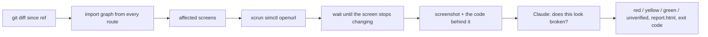

# routeshot

Screenshot every expo-router screen a change touched, and ask Claude, with the screen's code in
hand, whether it looks broken.

Expo's OTA playbook says to install the update and eyeball it. This does the eyeballing: it works
out which screens your diff can affect, opens each one on the iOS Simulator, takes a picture, and
hands the picture and the code that rendered it to a model with one question: does this look
broken? Red fails the build.


That is a real run on the app in `example/`. The judge, reading `app/(tabs)/index.tsx` next to the
screenshot on the right, scored it 97 and called it `clipped`: "Title 'Routeshot Example
Application' is clipped both vertically and mid-word due to fixed-height overflow box." The pixel
diff in the middle is what `compare` produces when you want to see what moved; the verdict does
not depend on it.

## Quickstart

You need macOS with Xcode and an iOS simulator runtime, CocoaPods, Node 22+, pnpm 10
(`corepack enable` or `npm i -g pnpm`), and an Anthropic API key for the judge.

```sh
git clone https://github.com/ColeBlender/routeshot && cd routeshot
pnpm install
cd example && echo "ANTHROPIC_API_KEY=sk-ant-..." > .env.local
npx expo run:ios                      # builds the example app (a few minutes) and starts Metro
```

Leave that terminal on Metro and open a second one in `example/`:

```sh
pnpm exec routeshot capture --judge                     # 7 screens, all green, exit 0
# stop Metro, restart it with the broken screens: EXPO_PUBLIC_ROUTESHOT_SCENARIO=broken npx expo start
pnpm exec routeshot capture --judge --open              # 5 red, exit 1, report opens
```

Each capture takes about 20 seconds for the example's 7 routes and the judge a few seconds more.
The report (`.routeshot/runs/<run>/report.html`) shows every screen with its verdict, the model's
one-line caption, and the region it flagged drawn over the screenshot.

Now change one file and capture only what it touches:

```sh
echo "// touched" >> app/about.tsx
pnpm exec routeshot capture --changed-since HEAD --judge   # "1 of 7 screens affected: /about"
```

## In your own app

Add it to the scripts you already run. `capture` exits 1 when a screen is red, so `npm test`
fails the way it fails for a broken unit test:

```json
"test": "vitest run && routeshot capture --changed-since origin/main --judge"
```

Scheme and bundle id come from `app.json`; a development build is detected from `expo-dev-client`
in your dependencies and booted from Metro; dynamic routes need params in `routeshot.config.ts`
(the exact snippet to paste is printed when one is missing). `ANTHROPIC_API_KEY` is read from
`.env.local`, `.env`, or the shell. The package is not on npm yet; `npm i -D routeshot` and the
`@v1` tag arrive with the public release. Until then, clone and `pnpm link`.

## How it works



- Routes come from `expo-router`'s `getRoutesCore`, vendored, so the list cannot drift from what the router would actually serve.
- The import graph is static: `import`/`require` specifiers read from each route file, its `_layout` chain and everything they pull in, resolved the way Metro resolves them on iOS (relative paths, tsconfig `paths`, `.ios`/`.native` variants). A change to `app.json`, `package.json`, a Babel or Metro config counts as touching every screen. Files nothing imports are listed and ignored.
- The simulator layer is a port of `@expo/cli`'s `simctl.ts` and Expo Orbit's `simulator.ts`. A screen counts as settled when two consecutive frames 300 ms apart are identical, with a 5 s cap and a per-route override.
- The judge gets one screenshot, halved to fit the API's image limit, and the source that rendered it: route file first, then layouts, then imports, up to 60 KB. It is told to report a defect only when the screenshot cannot be explained by a state the code allows (loading, empty, signed out), and that copy, colors and layout choices are not defects. It never sees a "before" image: nobody signed off on that either. Classes: `clipped`, `overlap`, `offscreen`, `wrapped`, `missing`, `blank`, `error`, `other`, `none`. The score maps to green / yellow / red at 40 / 75; when the model cannot answer the screen is `unverified`, never a silent green.
- `compare` still diffs two runs pixel by pixel when you want to see what moved. It is a report, not the gate.

## What the numbers look like

Measured on the example app, iPhone 17 Pro simulator, iOS 26.5, development build loading from Metro:

| Comparison                                                                       | Result                                                        |
| -------------------------------------------------------------------------------- | ------------------------------------------------------------- |
| Two identical captures, 7 routes                                                 | 0 differing pixels on every route                             |
| Benign edits (copy tweak, color change, reordered list)                          | 0.30% to 0.47% of pixels on the 3 touched routes, 0 elsewhere |
| Deliberate defects (clipped title, off-screen button, overlap, blank, error box) | 1.17% to 10.65% on the 5 broken routes, 0 elsewhere           |
| A full 7-route capture                                                           | about 19 seconds; screens settle in 0.9 to 3.3 seconds        |

The judge, scored with `pnpm judge:eval` over every screen of the `baseline`, `benign` and `broken`
runs, twice (`claude-sonnet-5`, thresholds 40 / 75):

| Screen              | State                            | Score  | Verdict                 |
| ------------------- | -------------------------------- | ------ | ----------------------- |
| Home                | title clipped mid-word           | 97, 97 | red, `clipped`          |
| About               | error box instead of content     | 92, 95 | red, `error`            |
| Explore             | badge drawn over the caption     | 96, 96 | red, `overlap`          |
| Item detail         | blank below the header           | 97, 97 | red, `blank`            |
| Billing             | primary button pushed off-screen | 92, 92 | red, `missing`          |
| 7 baseline screens  | as designed                      | 0 to 5 | green                   |
| 7 benign screens    | copy, color, order changed       | 0 to 5 | green, captions say why |
| 2 untouched screens | in the broken run                | 3, 5   | green                   |

42 of 42 verdict levels, 42 of 42 defect labels, 0 unverified across both passes. Fine screens sit
at 0 to 5 and broken ones at 92 to 97, so the 40 / 75 thresholds are not doing delicate work here.

Two honest caveats. The example's defects are switched on by a flag the code shows
(`isBroken ? styles.pushedOffscreen : undefined`), so the model can read the intent in the branch;
a real regression carries no such label. And 21 screens is a small set. A larger labeled set with
real regressions is the first thing to build before trusting the thresholds on your app.

## EAS update mode

`routeshot capture --update-url <manifest URL>` loads a specific published update before
capturing, so you can judge update N (or diff it against N-1) with no rebuild. Two URL forms work,
and both are what the EAS dashboard hands you:

- `https://u.expo.dev/update/<updateId>` is one platform's update. `eas update --json` prints it as
  `manifestPermalink`, and it is the most precise thing to pass from CI.
- `https://u.expo.dev/<projectId>/group/<groupId>` is the whole update group; the server picks the
  platform from the request headers.

**On a development build this needs nothing else.** `expo-dev-client`'s launcher takes a manifest
URL exactly where it takes a Metro URL, so an ordinary `npx expo run:ios` build, with rollback
protection left on, loads any published update for its runtime version. Verified end to end on
iOS: two updates published to one branch, captured through `--update-url`, and the diffs matched
the Metro-driven runs to the pixel.

The **runner build** is only for the release path, where there is no launcher: a build whose
`app.config` sets `updates.disableAntiBrickingMeasures: true` only when `EAS_BUILD_PROFILE` is
`routeshot`, and whose root layout calls `useRouteshotUpdateOverride()` from `routeshot/expo`. The
override is Expo's own `Updates.setUpdateURLAndRequestHeadersOverride`, and such a build is never
shipped to users. See `example/` for the exact `eas.json` and `app.config.ts`.

## GitHub Action

```yaml
- uses: actions/checkout@v5
  with:
    fetch-depth: 0 # changed-since needs the merge base
- uses: ColeBlender/routeshot@main
  with:
    project-root: example
    changed-since: origin/${{ github.base_ref }}
    server-url: ${{ secrets.ROUTESHOT_SERVER_URL }}
    server-token: ${{ secrets.ROUTESHOT_SERVER_TOKEN }}
```

Runs on a macOS runner, captures the screens the PR touched, uploads the run (screenshots and the
code behind each one) to the report server, and leaves one comment on the PR that lists the
screens with a verdict other than green, the model's caption, and a link to the hosted report.
Set `fail-on-change: true` to fail the job when anything changed above the pixel threshold. Inputs
are passed to the scripts as environment variables, never interpolated into them, since a branch
name on a fork PR is attacker-controlled.

## Report server

`packages/server` is a small Hono service (Postgres for runs, PNGs and code bundles) that hosts
reports, resolves baselines by branch, diffs two runs pixel by pixel, and judges every changed
screen against its uploaded code with your `ANTHROPIC_API_KEY`. Same prompt, same model, same
thresholds as the CLI, so a verdict from a laptop and one from CI are the same verdict. Deploy it
to Railway with `.railway/railway.ts`. One shared bearer token per repo in v1.

## Limitations

- iOS only. The `Simulator` interface is the seam for an `adb` adapter.
- Dynamic routes (`[id]`) need params in `routeshot.config.ts`; without them the route is skipped loudly and the exact snippet to paste is printed.
- Screens behind authentication capture whatever the app shows when opened cold. The judge is told that signed-out and loading states the code allows are not defects; a screen that only ever shows a spinner cold will still be judged as what it is.
- The import graph is static. Dynamic `require` with a computed path, Metro plugins that rewrite imports, and packages outside the project directory (a monorepo sibling) are invisible to `--changed-since`; when in doubt, run without it and capture everything.
- The judge reads at most 60 KB of source per screen, route file and layouts first. Deep component trees get truncated, and the truncation is listed in the prompt.
- Route modules are never evaluated, so routes that exist only through `generateStaticParams` are not discovered. One params fixture per dynamic template is captured.
- Settle detection is a heuristic. Screens with permanent animation hit the 5 s cap and are reported as not settled.
- Pixel noise was measured at zero on one machine. Baselines and candidates should still come from the same runner image; a hosted macOS runner has not been measured yet.
- The judge's score is not calibrated probability. Thresholds were tuned on the example app's labeled screens only (`pnpm judge:eval`), and the model's answer is not deterministic; the eval runs every screen twice for that reason.
- One device size, one appearance per run.

## Prior art

Sherlo does OTA-aware visual testing as a hosted product driven by Storybook stories. react-native-owl
and Maestro screenshot what you script. routeshot walks the routes expo-router already knows about,
so there is nothing to register.

## Built on Expo's code

`packages/routeshot/src/vendor/` carries `getRoutesCore.ts`, `matchers.tsx`, and the fs-backed
`RequireContext` ponyfill from `expo/expo`, with the commit SHA in each header. `simulator.ts` is a
port of `@expo/cli` and Expo Orbit. If this were upstream work, the two things worth publishing are
a public `getRoutes` entry that takes a filesystem context, and the simctl helpers as a package.

## How this was built

Written with Claude Code over a few sessions. Claude drafted most of the code and tests against a
spec I wrote; I reviewed every diff before it landed. Two decisions I made against its output.
It set the diff threshold to 1% and called anything under that "simulator noise"; I measured
instead. Identical captures differ by zero pixels and the smallest real change moves 0.30%, so 1%
would have reported every benign edit as unchanged. The default is 0.1%. And its first judge
compared a "before" and an "after" screenshot, which quietly assumes somebody approved the before.
Nobody did. The judge now reads the screen's code instead, and the before image is gone; the eval
numbers above are from that version. The repo's own `AGENTS.md` is the map it worked from.

## License

MIT
