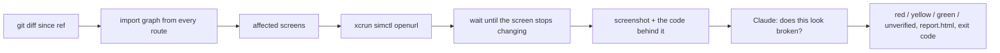

# routeshot in detail

Everything the [README](../README.md) leaves out: how it works, what was measured, every option,
the hosted judge, the EAS update mode, the GitHub Action, the report server, the limitations, and
how it was built.

## How it works


The judge, reading `app/(tabs)/index.tsx` next to the screenshot on the right, scored it 97 and
called it `clipped`: "Title 'Routeshot Example Application' is clipped mid-word inside a
fixed-height overflow box." The pixel diff in the middle is what `compare` produces; the verdict
does not depend on it.



- **Routes** come from `expo-router`'s own `getRoutesCore`, vendored and fed a filesystem-backed
  `require.context`, so the list cannot drift from what the router would serve. Route modules are
  never evaluated. Dynamic segments (`[id]`) get their value from `routes.params` in
  `routeshot.config.ts`; without one the route is skipped and the exact snippet to paste is
  printed.
- **Which screens a change touched** is a static import graph: `import`/`require` specifiers read
  from each route file, its `_layout` chain from the app root down, and everything they pull in,
  resolved the way Metro resolves them on iOS (relative paths, tsconfig `paths`, `.ios` and
  `.native` variants, index files), never evaluated, capped at 400 files per route.
  `--changed-since <ref>` intersects that graph with `git diff` against the merge base. A change to
  `app.json`, `package.json`, a lockfile, a Babel, Metro or Tailwind config, `tsconfig` or
  `global.css` counts as touching every screen. Changed files nothing imports are listed and
  ignored.
- **The simulator layer** is a port of `@expo/cli`'s `simctl.ts` and Expo Orbit's `simulator.ts`.
  Before the first screenshot it boots the device (whatever is booted, else the newest iPhone),
  freezes the status bar (clock, battery, signal), sets light or dark appearance, and pre-approves
  the app's URL scheme so iOS never shows the "Open in App?" sheet. A development build is handed
  its bundle URL through the same `exp+<slug>://expo-development-client/?url=` launcher link the
  EAS dashboard's QR code encodes, because the dev launcher drops any other deep link it starts
  with; the dev menu's floating button and onboarding sheet are switched off through its own
  defaults keys. Then each route is opened as `<scheme>://<path>` in the running app.
- **A screen counts as settled** when two consecutive frames 300 ms apart hash identical (simctl
  re-encodes the same framebuffer to byte-identical PNGs), with a 5 s cap and a per-route override
  in `routes.waitFor`. A screen that never settles is captured anyway and marked as such, never
  silently passed.
- **The judge** gets one screenshot, halved until it is at most 1600 px tall, and the source that
  rendered it: route file first, then layouts root to leaf, then imports breadth-first, up to
  60 KB, with imported assets listed by name and anything that did not fit named as omitted. One
  question: does this screen look broken? It is told that loading, empty, signed-out and
  permission-denied states the code renders on purpose are not defects, that copy, colors and
  layout choices are not defects, and that an error box, stack trace, crash screen or "something
  went wrong" fallback is a defect even when the code has a branch for it. It never sees a
  "before" image: nobody signed off on that either. Classes: `clipped`, `overlap`, `offscreen`,
  `wrapped`, `missing`, `blank`, `error`, `other`, `none`. The score (0 to 100, how likely the
  screen is broken) maps to green / yellow / red at 40 / 75; `defect: none` caps the level at
  yellow. Four screens are judged at a time, each with a 60 s timeout and one retry on an
  unparseable answer. When the model cannot answer, the screen is `unverified`, never a silent
  green, and never fails the run.
- **Where the model runs.** With `ANTHROPIC_API_KEY` in the shell or in `.env.local` next to the
  app, the CLI calls Anthropic directly (`claude-sonnet-5` unless `ANTHROPIC_MODEL` says otherwise).
  Without a key, and with `server` configured, it sends the same content blocks to the report
  server's `POST /judge`, which asks the model with its own key and returns the text; parsing,
  the retry and the thresholds stay on the CLI side, so a remote verdict is scored exactly like a
  local one. The example app ships a judge-only demo token for this, which is why the README
  quickstart needs no key.
- **The outcome** is a run directory under `.routeshot/runs/<timestamp>-<label>-<sha>/`:
  `index.json`, one PNG and one `.code.txt` per captured screen, and after judging `verdicts.json`
  and a self-contained `report.html` (worst screen first, the suspected region drawn over the
  screenshot). A red screen exits 1, the same way a failing unit test does; `--no-fail` turns that
  off.
- **`compare`** still diffs two runs pixel by pixel with pixelmatch when you want to see what
  moved, and writes its own `report.html` and diff masks. It is a report, not the gate.

## What the numbers look like

Measured on the example app, iPhone 17 Pro simulator, iOS 26.5, development build loading from
Metro:

| Comparison                                                                       | Result                                                        |
| -------------------------------------------------------------------------------- | ------------------------------------------------------------- |
| Two identical captures, 7 routes                                                 | 0 differing pixels on every route                             |
| Benign edits (copy tweak, color change, reordered list)                          | 0.30% to 0.47% of pixels on the 3 touched routes, 0 elsewhere |
| Deliberate defects (clipped title, off-screen button, overlap, blank, error box) | 1.17% to 10.65% on the 5 broken routes, 0 elsewhere           |
| A full 7-route capture                                                           | about 19 seconds; screens settle in 0.9 to 3.3 seconds        |

The judge, scored with `pnpm judge:eval` over every screen of the `baseline`, `benign` and `broken`
runs (`claude-sonnet-5`, thresholds 40 / 75):

| Screen              | State                            | Score  | Verdict                 |
| ------------------- | -------------------------------- | ------ | ----------------------- |
| Home                | title clipped mid-word           | 97     | red, `clipped`          |
| About               | error box instead of content     | 97     | red, `error`            |
| Explore             | badge drawn over the caption     | 95     | red, `overlap`          |
| Item detail         | blank below the header           | 96     | red, `blank`            |
| Billing             | primary button pushed off-screen | 92     | red, `missing`          |
| 7 baseline screens  | as designed                      | 0 to 5 | green                   |
| 7 benign screens    | copy, color, order changed       | 0 to 5 | green, captions say why |
| 2 untouched screens | in the broken run                | 3      | green                   |

Over three consecutive passes of all 21 screens: 63 of 63 verdict levels, 63 of 63 defect labels,
0 unverified. Fine screens sit at 0 to 5 and broken ones at 92 to 97, so the 40 / 75 thresholds
are not doing delicate work here.

That was not the first result. Before the prompt said an error fallback is a defect even when the
code has a branch for it, the broken About screen (a designed "Something went wrong" box) came
back green one pass in three: scores 5, 90, 92, caption "isBroken flag triggers the intentional
error state defined in code; not a real defect." The model was reading the branch and calling the
state allowed. One sentence in the prompt, and the same three passes gave 97, 97, 97.

Two honest caveats. The example's defects are switched on by a flag the code shows
(`isBroken ? styles.pushedOffscreen : undefined`), so the model can read the intent in the branch;
a real regression carries no such label. And 21 screens is a small set. A larger labeled set with
real regressions is the first thing to build before trusting the thresholds on your app.

## Options

Four commands. Human output goes to stderr; `--json` puts one machine-readable object on stdout.
Any error exits 1.

```
routeshot capture [options]              deep link every route, screenshot it, write a run
  --label <name>                         run name (default: the git branch)
  --device <name>                        simulator, e.g. "iPhone 17 Pro" (default: booted, else newest)
  --appearance light|dark
  --changed-since <ref>                  only the screens whose code changed against this ref
  --judge                                then ask the model; exits 1 on red
  --no-fail                              with --judge, exit 0 even when a screen is red
  --open                                 with --judge, open report.html
  --upload                               POST the run (and its verdicts) to the report server
  --update-url <url>                     load this EAS update before capturing
  --dev-client [url] / --no-dev-client   override the expo-dev-client detection
  --json

routeshot judge [run]                    judge a run already on disk (default: latest)
  --no-fail  --open  --json

routeshot upload <run>                   send a run on disk to the report server
  --json

routeshot compare <baseline> <candidate> pixel diff two runs, write report.html + report.json
  --threshold <ratio>                    fraction of differing pixels that counts as changed
  --remote                               both runs live on the server; refs are ids or branch names
  --no-fail  --open  --json
```

A `<run>` is a run id, a `--label`, a directory, or `latest` / `previous` by modification time.

`routeshot.config.ts` (also `.js`, `.mjs`, `.json`) is loaded with c12 through jiti, so a TypeScript
config needs no build step. Everything is optional; `scheme` and `bundleId` come from `app.json`
when omitted.

```ts
import { defineConfig } from 'routeshot';

export default defineConfig({
  scheme: 'myapp', // expo.scheme
  bundleId: 'com.example.myapp', // expo.ios.bundleIdentifier
  device: 'iPhone 17 Pro',
  appearance: 'light',
  routes: {
    params: { '/items/[id]': { id: '42' } }, // fixtures for dynamic segments
    ignore: ['/debug/**'], // globs against the template and the filled-in path
    waitFor: { '/feed': 10_000 }, // per-route settle cap in ms
  },
  settle: { intervalMs: 300, stableFrames: 2, timeoutMs: 5000 },
  threshold: 0.001, // compare: 0.1% of pixels
  devClient: { url: 'http://localhost:8081' }, // default when expo-dev-client is a dependency
  server: { url: 'https://…', token: process.env.ROUTESHOT_SERVER_TOKEN! },
});
```

Environment: `ANTHROPIC_API_KEY`, `ANTHROPIC_MODEL`, `JUDGE_YELLOW`, `JUDGE_RED` for the judge
(read from the shell, then `.env.local`, then `.env` next to the app); `ROUTESHOT_SERVER_URL` and
`ROUTESHOT_SERVER_TOKEN` when `server` is not in the config, which is how CI passes them without a
token in git.

Programmatic use: `import { captureAsync, judgeRunAsync, diffRunsAsync } from 'routeshot'`. The
CLI is a thin wrapper over the exported functions; `routeshot/expo` is the one entry meant to be
bundled into an app (see EAS update mode).

## The hosted judge

The report server exposes `POST /judge`, which takes the content blocks of one judge request and
answers with the model's text, using the server's key, prompt and model. It accepts either the
repo's real token or a second, judge-only demo token. The demo token is committed in
`example/routeshot.config.ts` on purpose: it cannot upload, list or compare (those answer 401),
it is rate limited per minute like every other caller, and it spends against the same daily cap
(`JUDGE_DAILY_CAP`, 500 calls) as everything else, after which the server answers 429 and the CLI
reports every screen as `unverified` rather than green. It buys exactly one thing: the question the
judge asks, with the server's prompt, about whatever screenshot and code the caller sends.

## EAS update mode

`routeshot capture --update-url <manifest URL>` loads a specific published update before
capturing, so you can judge update N (or diff it against N-1) with no rebuild. Two URL forms work,
and both are what the EAS dashboard hands you:

- `https://u.expo.dev/update/<updateId>` is one platform's update. `eas update --json` prints it as
  `manifestPermalink`, and it is the most precise thing to pass from CI.
- `https://u.expo.dev/<projectId>/group/<groupId>` is the whole update group; the server picks the
  platform from the request headers.

**On a development build this needs nothing else.** `expo-dev-client`'s launcher takes a manifest
URL exactly where it takes a Metro URL, so an ordinary `npx expo run:ios` build, with rollback
protection left on, loads any published update for its runtime version. Verified end to end on
iOS: two updates published to one branch, captured through `--update-url`, and the diffs matched
the Metro-driven runs to the pixel (Home 10.65%, Billing 4.27%, Explore 2.33%, About 2.06%, Item
1.17%, the other two exactly 0). Two captures of the same published update, loaded fresh each
time, differed by 0 pixels.

The **runner build** is for the release path, where there is no launcher: a release simulator
build from the `routeshot` EAS profile, whose `app.config` sets
`updates.disableAntiBrickingMeasures: true` only under that profile, and whose root layout calls `useRouteshotUpdateOverride()` from `routeshot/expo`. The CLI
launches the app, hands it `<scheme>://routeshot/update?url=<manifest>` as a deep link (launch
arguments never reach JS without a native module; `Linking` is already there), the hook applies
Expo's own `Updates.setUpdateURLAndRequestHeadersOverride`, and the CLI terminates and relaunches
because the override only takes effect on the next start. Such a build is never shipped to users.
See `example/` for the exact `eas.json` and `app.config.ts`. This path is unit-tested; the
dev-client path above is the one proven on a simulator.

## GitHub Action

```yaml
- uses: actions/checkout@v5
  with:
    fetch-depth: 0 # changed-since needs the merge base
- uses: ColeBlender/routeshot@main
  with:
    project-root: example
    changed-since: origin/${{ github.base_ref }}
    server-url: ${{ secrets.ROUTESHOT_SERVER_URL }}
    server-token: ${{ secrets.ROUTESHOT_SERVER_TOKEN }}
```

Runs on a macOS runner, builds the CLI from the action's own checkout, captures the screens the PR
touched, uploads the run (screenshots and the code behind each one) to the report server, asks the
server to compare it against the newest run from the default branch (or `baseline`), and leaves
one comment on the PR that lists the screens with a verdict other than green, the model's caption,
and a link to the hosted report. The server judges every changed screen against its uploaded
code. Set `fail-on-change: true` to fail the job when anything changed above the pixel threshold.
Inputs reach the scripts as environment variables, never interpolated into them, since a branch
name on a fork PR is attacker-controlled. Other inputs: `label`, `baseline` (a server run id or
branch name), `update-url`, `device`, `dev-client`, `github-token`; outputs: `run-id`,
`report-url`.

The action does not build the app. Your workflow builds or installs the simulator app first
(`npx expo run:ios`, or an EAS simulator build) and, for a development build, leaves a dev server
running. CocoaPods needs a UTF-8 locale on a runner (`LANG=en_US.UTF-8`); `expo prebuild` exits 0
even when `pod install` crashed on that, so export it.

## Report server

`packages/server` is a small Hono service, Postgres for runs, PNGs, code bundles and verdicts,
deployed to Railway from `.railway/railway.ts` and redeployed by the GitHub integration when
`packages/server/**` changes. One shared bearer token per repo in v1, plus the optional judge-only
demo token.

| Endpoint                                       | Token | What it does                                                                |
| ---------------------------------------------- | ----- | --------------------------------------------------------------------------- |
| `POST /runs`                                   | real  | multipart upload: `index.json`, PNGs, `.code.txt`, optional `verdicts.json` |
| `GET /runs?branch=&limit=`                     | real  | newest first; how `compare --remote main` resolves a branch to a run        |
| `GET /runs/:id`, `GET /runs/:id/files/:name`   | none  | the index and the screenshots, behind an unguessable id                     |
| `GET /runs/:id/report`                         | none  | the judge report for a run uploaded with its verdicts                       |
| `POST /judge`                                  | demo  | one judge question with the server's key                                    |
| `GET /compare?baseline=&candidate=&threshold=` | real  | diff, judge the changed screens with their code, cache by inputs            |
| `GET /r/:id`                                   | none  | the hosted compare report                                                   |
| `PUT /examples/:name`                          | real  | pin a judged run under a fixed public name                                  |
| `GET /examples/:name`                          | none  | that run's judge report; the README's two "see that report" links           |

Same prompt, same model, same thresholds as the CLI (`judge.ts` is copied verbatim into the
server), so a verdict from a laptop and one from CI are the same verdict. Ids are 16 random bytes;
report URLs are the only access control on the read side, which is what lets a browser open them.
Judge and compare calls are rate limited per token per minute (`COMPARE_RATE_LIMIT`, 60), and
every judge call counts against `JUDGE_DAILY_CAP`. Without `ANTHROPIC_API_KEY` the server still
hosts and diffs; verdicts are simply absent and `/judge` answers 501.

## Limitations

- iOS only. The `Simulator` interface is the seam for an `adb` adapter.
- Dynamic routes (`[id]`) need params in `routeshot.config.ts`; without them the route is skipped
  loudly and the exact snippet to paste is printed. One params fixture per dynamic template is
  captured.
- Screens behind authentication capture whatever the app shows when opened cold. The judge is
  told that signed-out and loading states the code allows are not defects; a screen that only
  ever shows a spinner cold will still be judged as what it is.
- The import graph is static. Dynamic `require` with a computed path, Metro plugins that rewrite
  imports, and packages outside the project directory (a monorepo sibling) are invisible to
  `--changed-since`; when in doubt, run without it and capture everything.
- The judge reads at most 60 KB of source per screen, route file and layouts first. Deep component
  trees get truncated, and the truncation is listed in the prompt.
- Route modules are never evaluated, so routes that exist only through `generateStaticParams` are
  not discovered.
- Settle detection is a heuristic. Screens with permanent animation hit the 5 s cap and are
  captured as not settled.
- Pixel noise was measured at zero on one machine. Baselines and candidates should still come
  from the same runner image; a hosted macOS runner has not been measured (the example builds
  there, but `expo run:ios`'s post-build launch timed out, so the dogfood job checks the install
  and stops).
- The judge's score is not a calibrated probability. Thresholds were tuned on the example app's
  labeled screens only (`pnpm judge:eval`), and the model's answer is not deterministic; the eval
  runs every screen several times for that reason.
- One device size, one appearance per run.

## Things that bit while building it

Kept because the next person to port this to Android or to a hosted runner will meet them again.

- `xcrun simctl io <udid> screenshot --type=png -` does not honour `-` as stdout on Xcode 26.6: it
  writes a PNG literally named `-` into the working directory. The screenshot helper spawns with
  `cwd: os.tmpdir()` and reads a temp file.
- iOS 26 shows an "Open in Routeshot Example?" sheet on the first `simctl openurl` of a custom
  scheme, running app or not. Writing `com.apple.launchservices.schemeapproval` and restarting
  SpringBoard clears it; the write does nothing until SpringBoard restarts.
- A development build cold-starts into the dev launcher and discards the deep link it was opened
  with. Opening the `exp+<slug>://expo-development-client/?url=` link first loads the bundle; the
  route link then works. The capture does this once, before the first route.
- expo-dev-menu's floating gear and its onboarding sheet land in screenshots. Both are off through
  its own defaults keys, per bundle id.
- `pod install` crashes on a non-UTF-8 locale with Ruby 4, and `expo prebuild` exits 0 anyway. A
  real terminal has `LANG` set; a script or a CI step has to set it.
- c12 loading a `.ts` config from an app without `"type": "module"` (every Expo app) makes Node
  print `MODULE_TYPELESS_PACKAGE_JSON` on every run. Loading through jiti directly skips that path.
- Full-size 1206x2622 screenshots produced hallucinated "duplicated content" reds on two clean
  screens; halving them fixed it. `claude-sonnet-5` rejects `temperature`. The SDK's
  `messages.parse` throws on a truncated answer, which skipped the retry; JSON is requested through
  `output_config` on `create` and parsed locally.
- Without the code bundle the hosted judge missed the off-screen Billing button (pixels alone look
  like a short page); with it, 5 of 5 red. That is the before-image argument settled by
  measurement.
- pnpm never linked the `routeshot` bin on a fresh clone because `dist/cli.js` did not exist at
  install time; `prepare: tsdown` builds it during install for both npm and pnpm.

## Prior art

Sherlo does OTA-aware visual testing as a hosted product driven by Storybook stories. react-native-owl
and Maestro screenshot what you script. routeshot walks the routes expo-router already knows about,
so there is nothing to register.

## Built on Expo's code

`packages/routeshot/src/vendor/` carries `get-routes-core.ts`, `matchers.ts`, `route-node.ts`,
`url.ts` and the fs-backed `RequireContext` ponyfill from `expo/expo`, with the commit SHA in each
header. `simulator.ts` is a
port of `@expo/cli` and Expo Orbit. If this were upstream work, the two things worth publishing are
a public `getRoutes` entry that takes a filesystem context, and the simctl helpers as a package.

## How this was built

Written with Claude Code over a few sessions. Claude drafted most of the code and tests against a
spec I wrote; I reviewed every diff before it landed. Three decisions I made against its output.
It set the diff threshold to 1% and called anything under that "simulator noise"; I measured
instead. Identical captures differ by zero pixels and the smallest real change moves 0.30%, so 1%
would have reported every benign edit as unchanged. The default is 0.1%. Its first judge compared
a "before" and an "after" screenshot, which quietly assumes somebody approved the before. Nobody
did. The judge now reads the screen's code instead, and the before image is gone. And when the
About screen's error box came back green one pass in three, the fix was one sentence in the prompt
and three more eval passes, not a special case for the example. The eval numbers above are from
that version. The repo's own `AGENTS.md` is the map it worked from.
